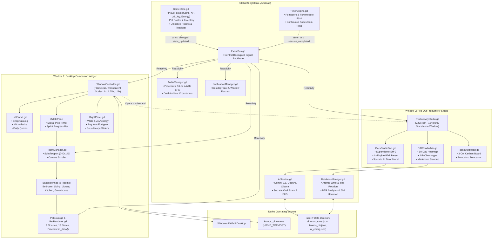

# ⏳ KRONOS — Master Codebase Connections & Architecture Overview

> **Single-Source-of-Truth Architectural Blueprint for Humans & AI Agents**  
> **Project:** Kronos (Desktop Focus Companion & Study Ecosystem)  
> **Engine:** Godot Engine 4.7.1 / 4.7.2 (GDScript 2.0) • Forward+ / GL Compatibility  
> **Repository:** `Unlighted01/Kronos` • **Development Window:** July 2, 2026 – September 8, 2026 (~9+ Weeks, 46 Commits)  
> **Art Style:** Pure Procedural Pixel Art (`_draw()`) • 0 External PNG Environment Dependencies  
> **Current State:** Active Production Widget with Dual-Window Widescreen Productivity Studio & Socratic AI Tutor  

---

## 📑 Table of Contents

1. [Project Mission & Purpose](#1-project-mission--purpose)
2. [Development History, Timeline & Phases](#2-development-history-timeline--phases)
3. [Technology Stack & Specifications](#3-technology-stack--specifications)
4. [File Structure & Directory Taxonomy](#4-file-structure--directory-taxonomy)
5. [System Architecture & Data Flow Diagram](#5-system-architecture--data-flow-diagram)
6. [Autoloads & Global Singletons (The Core Layer)](#6-autoloads--global-singletons-the-core-layer)
7. [Comprehensive Signal Matrix (EventBus)](#7-comprehensive-signal-matrix-eventbus)
8. [Scene Tree & Window Layout Architecture](#8-scene-tree--window-layout-architecture)
9. [The Living World: Multi-Room Procedural Biomes](#9-the-living-world-multi-room-procedural-biomes)
10. [Autonomous Companion Engine & Living Household](#10-autonomous-companion-engine--living-household)
11. [Productivity Studio & Spaced Repetition (SRS) Engine](#11-productivity-studio--spaced-repetition-srs-engine)
12. [BYOK AI Architecture & Socratic Tutor Sanctuary](#12-byok-ai-architecture--socratic-tutor-sanctuary)
13. [Local Persistence & Data Storage Model](#13-local-persistence--data-storage-model)
14. [AI Rules of Engagement, Build Validation & Tooling](#14-ai-rules-of-engagement-build-validation--tooling)

---

## 1. Project Mission & Purpose

### 1.1 What Kronos Does
**Kronos** is an indie desktop productivity companion that solves remote work and study isolation. It combines an autonomous, procedural 2D Tamagotchi-style companion living inside interconnected mythological pixel biomes with a high-yield study suite:
- **Dual Focus Engine**: Classic Pomodoro (`25/5`, `50/10`, `90/20`) + flexible Flowmodoro count-up stopwatch that dynamically calculates earned break intervals based on focus duration.
- **Continuous Focus Economy**: Players earn Gold Coins and Pet EXP continuously every 10 seconds of active work (+50% coin speed buff if pet Energy >= 70%).
- **SuperMemo SM-2 Spaced Repetition**: Flashcard system with "Due Today" queues, interval multiplier scheduling, retention curves, and knowledge points (KP).
- **Automated Biometric Daily Time Record (DTR)**: 60-day interactive consistency heatmap, 24-hour peak flow chronotype histogram, inline reflection editor, 1-click Markdown Standup generator for team syncs, and CSV exporter.
- **BYOK AI Socratic Study Tutor**: Bring-Your-Own-Key integration (Google Gemini, OpenAI, Local Ollama) featuring in-engine PDF text decompression, flashcard synthesis, and natural-language oral exams gated exclusively inside the Vintage Library sanctuary.
- **Multi-Species Household**: Adopt, groom, feed, dress, and co-work with up to 8 procedural species who navigate rooms, socialize, sit at the desk when you study, and embark on outdoor strolls.

### 1.2 Dual-Window Workflow Architecture
Unlike traditional monolithic productivity apps or screen-hogging web dashboards, Kronos uses a decoupled dual-window system:
1. **Desktop Companion Widget (`300×400` default viewport)**: Borderless, transparent, Always-on-Top desktop pet resting in the corner of the screen. Features 3 collapsible drawers (`LeftPanel` for Shop/Tasks, `MiddlePanel` for Pet Canvas & Timer Dock, `RightPanel` for Vitals & Bag).
2. **Pop-Out Productivity Studio (`720×460` – `1248×800`)**: Independent widescreen desktop window toggled via `[📊 Studio]` button or `Ctrl+D` / `F1`. Contains deep-dive analytics, Kanban tasks board, and the flashcard study deck.

```
┌─────────────────────────────────────────────────────────────────────────────┐
│                    📊 KRONOS PRODUCTIVITY STUDIO (Window 2)                 │
│       [📊 DTR & Analytics]       [🧠 Study Deck & SRS]       [📋 Tasks & Forecast]       [✕] │
├─────────────────────────────────────────────────────────────────────────────┤
│  • 60-Day Interactive Heatmap        • SuperMemo SM-2 Study Queue   • 3-Col Kanban Board    │
│  • 24h Chronotype Flow Histogram     • AI Flashcard Synthesizer     • Pomodoro Forecaster   │
│  • 1-Click Markdown Standup / CSV    • Socratic Oral Exam Arena     • "▶ Focus Now" Binder  │
└─────────────────────────────────────────────────────────────────────────────┘
               ▲ Toggled on demand via [📊 Studio] or Ctrl+D / F1
┌──────────────────────────┬──────────────────────────┬───────────────────────┐
│   LEFT PANEL (235px)     │   MIDDLE PANEL (270px)   │  RIGHT PANEL (200px)  │
├──────────────────────────┼──────────────────────────┼───────────────────────┤
│ 🛍️ SHOP, TASKS & QUESTS  │ 🐾 PROCEDURAL PET ROOM   │ 📊 VITALS, BAG & DTR  │
│ • Treats, Outfits, Rooms │ • 240×140 Virtual Canvas │ • Level, EXP, Energy  │
│ • Micro-Tasks Checklist  │ • Glowing Pixel Timer    │ • Inventory Items     │
│ • Daily Pet Quests       │ • Floating Action Dock   │ • Soundscape Sliders  │
│ • Energy Buff Banner     │ • Biome Room Transitions │ • Window Scale Dropdown│
└──────────────────────────┴──────────────────────────┴───────────────────────┘
  (Window 1: Frameless, transparent, draggable, pinned via kronos_pinner.exe)
```

---

## 2. Development History, Timeline & Phases

### 2.1 Timeline & Milestones
- **Project Inception:** **July 2, 2026** (Initial repository commit `a39c719`).
- **Total Development Duration:** ~9+ weeks of continuous engineering across 46 commits.
- **The Pivot (August 18, 2026 - Commit `41b2f50`):** Kronos began as an Electron / Node.js / HTML5 / Tailwind CSS app. Facing heavy RAM usage, OS window jitter, and clumsy sprite scaling, the entire codebase was ported to **Native Godot 4**. The legacy JavaScript codebase was eliminated, yielding sub-60MB RAM usage, instantaneous cold boots, and pixel-perfect rendering.

### 2.2 Evolutionary Phases Breakdown

| Phase | Milestone Name | Commit / Date | Key Modules & Accomplishments |
| :---: | :--- | :--- | :--- |
| **0.0** | *Electron Prototype* | `a39c719` – `b8afc1f`<br>*(Jul 2 – Aug 14)* | Three-panel layout, HTML5 DTR, moon phases, Tailwind v4, WebAudio SFX, virtual canvas scaling. |
| **1.0** | **Godot 4 Native Migration** | `41b2f50`<br>*(Aug 18)* | Complete rewrite in GDScript. Ported `GameState`, `TimerEngine`, `EventBus`, and basic room layout. |
| **2.0** | **Procedural Biomes & Day/Night** | `6c798d1` – `98d7f58`<br>*(Aug 18 – Aug 20)* | 5 interconnected procedural rooms via `BaseRoom.gd`, continuous alarm loops, daily quests, day/night lighting. |
| **3.0** | **Break Arcade & Pet Economy** | `f4b36fa` – `68ba687`<br>*(Aug 20)* | 3-in-1 minigames (Snack Catch, Memory Match, Plant Bloom), Shop catalog, treats, and cosmetic slots. |
| **4.0** | **Spaced Repetition & Flowmodoro** | `1ad1c31` – `01a5801`<br>*(Aug 23)* | Active Recall Flashcard Engine, Knowledge Points (KP), Flowmodoro count-up stopwatch mode. |
| **5.0** | **Multi-Pet Living Household** | `45a36c8` – `0a2342b`<br>*(Aug 23 – Aug 24)* | 8 distinct species, 13 animation states, weighted-random idle interactions, outdoor expeditions, bag stow logic. |
| **6.0** | **Study Deck Suite & Window Scaler** | `f453c32` – `89fd415`<br>*(Aug 24 – Aug 25)* | RightPanel deck manager, drill launcher, window scaling presets (`1.25x`, `1.5x`, `2.0x`), native OS notifications. |
| **7.0** | **Mythical Polish & Dynamic Weather**| `274adc9` – `935ff4a`<br>*(Aug 26 – Aug 28)* | WeatherRenderer (rain, snow, sunbeams, stars), living dialogue bubbles, and physics boundary hardening. |
| **8.0** | **Productivity Studio (Dual Window)** | `11c0138` – `5ea9ddf`<br>*(Aug 29 – Aug 30)* | Standalone `ProductivityStudio.tscn`, 60-day DTR heatmap, peak flow histogram, standup markdown, custom pixel theme. |
| **9.0** | **BYOK AI & Socratic Tutor Sanctuary**| `c2bd895` – Present<br>*(Sep 2 – Sep 8)* | `AIService.gd`, `DocumentParser.gd` (FlateDecode PDF parser), Gemini 2.5 Flash / OpenAI / Ollama, Socratic Oral Exams in Library. |

---

## 3. Technology Stack & Specifications

```
┌─────────────────────────────────────────────────────────────────────────────┐
│                             KRONOS TECH STACK                               │
├───────────────────────┬─────────────────────────────────────────────────────┤
│ Core Engine           │ Godot Engine 4.7.1 / 4.7.2 (Windows x64 Console)   │
│ Language              │ GDScript 2.0 (Static Typing, Strict Signals)        │
│ Graphics / Art Style  │ 100% Procedural 2D Pixel Art via mathematical _draw │
│ Windowing             │ Multi-Window (DisplayServer, Frameless, Transparent)│
│ OS Native Interop     │ C++ Win32 Helper (kronos_pinner.exe, HWND_TOPMOST)  │
│ Audio Engine          │ Runtime Procedural Waveform Synthesis (16-bit 44kHz)│
│ AI / LLM Engine       │ BYOK REST API (Google Gemini, OpenAI, Local Ollama) │
│ Ingestion / Parsing   │ Pure GDScript FlateDecode / CMap PDF Text Extractor │
│ Local Persistence     │ Atomic JSON Serialization (user:// with .bak rotate)│
│ Verification          │ Godot Headless CLI Test Suites (TestRunner.gd)      │
└───────────────────────┴─────────────────────────────────────────────────────┘
```

### 3.1 Procedural Drawing Engine
Kronos uses **zero external PNG environment assets**. Everything on the `240×140` virtual canvas is procedurally generated at runtime using Godot's `_draw()` callback:
- Room floors, wallpapers, wainscoting, wood grain, vaulted rafters, and bricks.
- Dynamic furniture (hearth flames, spinning turntable, celestial globe, daybeds, workstation monitors).
- Companions (fur coats, ear twitches, facial masks, blinking eyes, paws, wagging tails).
- Wearables (crowns, wizard hats, beanies, glasses, scarves, bowties).
- Atmospheric particle effects (translucent sunbeams, falling snow, rain streaks, star twinkles, dream orbs).

### 3.2 Procedural Audio Engine (`AudioManager.gd`)
Kronos generates 100% of its audio on the fly using mathematical audio buffers (`AudioStreamWAV`):
- **SFX**: Chiptune square waves, triangle pulses, and frequency sweeps for button clicks, coin chimes, leveling up, eating munch sounds, light switch toggles, and continuous alarm bells.
- **Ambient Soundscapes**: Dual crossfading looping channels generating room-specific ambient noise (Bedroom silence/clock tick, Living Room hearth crackle, Library paper rustle, Kitchen bubbling, Greenhouse breeze).

### 3.3 Native Window Pinner (`kronos_pinner.exe`)
Because Windows Desktop Window Manager (DWM) frequently strips the `WS_EX_TOPMOST` flag when third-party applications enter exclusive fullscreen, Kronos ships a compiled 600-byte C++ Win32 helper (`bin/kronos_pinner.exe`) that executes:
```cpp
SetWindowPos(hwnd, HWND_TOPMOST, 0, 0, 0, 0, SWP_NOMOVE | SWP_NOSIZE | SWP_NOACTIVATE);
```
This guarantees the companion widget remains glued over code editors, terminals, and browsers.

---

## 4. File Structure & Directory Taxonomy

```
c:\Users\netne\Kronos\Kronos Project\
├── .agents/
│   └── AGENTS.md                   # Non-negotiable agent instructions & build rules
├── .vscode/                        # Editor configuration & GDScript language client
├── bin/
│   ├── kronos_pinner.exe           # Compiled Win32 topmost helper binary
│   └── src/
│       └── kronos_pinner.cpp       # Source C++ Win32 SetWindowPos implementation
├── docs/                           # Architectural design documents & asset notes
├── kronos-godot/                   # Primary Godot 4 project directory
│   ├── project.godot               # Engine configuration & 7 Autoload definitions
│   ├── export_presets.cfg          # Windows Desktop headless export presets
│   ├── icon.png                    # Application logo & system icon
│   │
│   ├── scripts/
│   │   ├── autoload/               # Global Singletons (loaded on boot)
│   │   │   ├── GameState.gd        # Player stats, pets roster, inventory, rooms
│   │   │   ├── EventBus.gd         # Decoupled signal backbone for the entire system
│   │   │   ├── TimerEngine.gd      # Pomodoro & Flowmodoro clock state machine
│   │   │   ├── DatabaseManager.gd  # Atomic JSON persistence & DTR data aggregation
│   │   │   ├── AudioManager.gd     # Procedural 44.1kHz SFX & ambient soundscapes
│   │   │   ├── NotificationManager.gd # In-app pixel toasts & desktop taskbar alerts
│   │   │   └── AIService.gd        # Multi-provider BYOK LLM client & prompt engine
│   │   └── utils/
│   │       └── DocumentParser.gd   # Pure GDScript FlateDecode PDF & note segmenter
│   │
│   ├── scenes/
│   │   ├── main/
│   │   │   ├── MainWorkspace.tscn  # Root companion application scene
│   │   │   ├── WindowController.gd # Desktop drag, scaling, and 3-panel layout logic
│   │   │   ├── DesktopToast.tscn   # OS floating desktop alert window
│   │   │   ├── AchievementPopup.tscn # Retro unlocked trophy banner
│   │   │   └── SplashIntro.tscn    # Crowned Shiba RPG opening ceremony
│   │   │
│   │   ├── panels/
│   │   │   ├── LeftPanel.tscn      # Shop, Inventory, Micro-Tasks, Daily Quests
│   │   │   └── RightPanel.tscn     # Vitals, Bag actions, Soundscape Mixer, Config
│   │   │
│   │   ├── pet/
│   │   │   ├── PetCompanion.tscn   # Main pet entity container
│   │   │   ├── PetBrain.gd         # Autonomous wandering FSM & task desk snap
│   │   │   ├── PetRenderer.gd      # Procedural pixel art _draw() for 8 species
│   │   │   ├── CosmeticLayer.gd    # Wearable hats, glasses, and neckwear renderer
│   │   │   ├── ThoughtBubble.tscn  # Pixel speech bubbles & emotion reactions
│   │   │   └── PetDeliveryBox.tscn # Parcel unboxing animation for new pets
│   │   │
│   │   ├── rooms/
│   │   │   ├── RoomManager.tscn    # Room container, camera scroller, viewport
│   │   │   ├── BaseRoom.gd         # Room base class (bounds, anchors, diurnal sky)
│   │   │   ├── Bedroom.tscn        # Study Bedroom (Temple of Morpheus)
│   │   │   ├── LivingRoom.tscn     # Hearth Lounge (Hearth of Hestia)
│   │   │   ├── Library.tscn        # Vintage Library (Sanctuary for AI Tutor)
│   │   │   ├── Kitchen.tscn        # Bakery Kitchen (Terracotta hearth)
│   │   │   ├── Greenhouse.tscn     # Botanical Greenhouse (Elysian Fields)
│   │   │   ├── Door.tscn           # Interactive directional doorway trigger
│   │   │   ├── Ladder.tscn         # Vertical attic climbing link
│   │   │   └── WeatherRenderer.gd  # Procedural rain, snow, sunbeams, stars
│   │   │
│   │   ├── productivity/
│   │   │   ├── ProductivityStudio.tscn # Standalone 720×460 pop-out analytics window
│   │   │   ├── ProductivityStudio.gd   # Studio tabs switcher, scaling & dragging
│   │   │   ├── DTRStudioTab.tscn       # 60-day heatmap, peak flow, standup CRUD
│   │   │   ├── DeckStudioTab.tscn      # SuperMemo SM-2 study deck & AI tutor modal
│   │   │   └── TasksStudioTab.tscn     # 3-col Kanban board & Pomodoro capacity
│   │   │
│   │   └── minigames/
│   │       ├── MinigameHub.tscn    # Break arcade menu launcher
│   │       ├── SnackCatchGame.tscn # Falling snacks rhythm catch game
│   │       ├── MemoryMatchGame.tscn# Card flip concentration game
│   │       ├── PlantBloomGame.tscn # Greenhouse rhythm flower growth
│   │       └── FlashcardEngine.tscn# Rapid-fire flashcard quiz arcade
│   │
│   ├── tests/
│   │   ├── TestRunner.gd           # 35-test comprehensive headless verification suite
│   │   ├── LiveTutorCLIRunner.gd   # Headless CLI runner for Gemini AI Socratic exams
│   │   ├── test_living_household.gd# Automated test for pet expeditions & dialogue
│   │   └── test_multi_pet_disambiguation.gd # Targeted feeding & cosmetic equipping
│   │
│   └── themes/
│       └── pixel_theme.tres        # Unified high-contrast indie pixel UI theme
│
├── Kronos Project Overview.md      # Legacy architectural roadmap
├── Kronos_overview.md              # Biome & pet feature reference
├── PRODUCTIVITY_STUDIO_PLAN.md     # Pop-out studio architectural blueprint
└── README.md                       # Public-facing repository documentation
```

---

## 5. System Architecture & Data Flow Diagram



---

## 6. Autoloads & Global Singletons (The Core Layer)

The entire project state and cross-system communication are managed by **7 Autoloads** configured in `project.godot`:

```ini
[autoload]
DatabaseManager="*res://scripts/autoload/DatabaseManager.gd"
EventBus="*res://scripts/autoload/EventBus.gd"
GameState="*res://scripts/autoload/GameState.gd"
TimerEngine="*res://scripts/autoload/TimerEngine.gd"
AudioManager="*res://scripts/autoload/AudioManager.gd"
NotificationManager="*res://scripts/autoload/NotificationManager.gd"
AIService="*res://scripts/autoload/AIService.gd"
```

### 6.1 Autoload Responsibilities & APIs

| Autoload | Core Responsibilities | Key Methods & Properties |
| :--- | :--- | :--- |
| **`GameState.gd`** | Central state store: player currency, pet level/exp, Joy, Energy, active household roster (`active_pets`), unlocked rooms, room topology, daily quests, and SM-2 flashcard decks. | `add_coins()`, `add_exp()`, `feed_pet()`, `equip_cosmetic()`, `is_in_study_library()`, `get_srs_stats()`, `get_srs_forecast()`, `serialize()`, `deserialize()` |
| **`EventBus.gd`** | Decoupled signal router. Prevents circular dependencies between UI, rooms, timer, and AI subsystems. | Over 45 strongly typed signals covering Timer, Economy, Quests, Rooms, Pets, Window, and Persistence. |
| **`TimerEngine.gd`** | Pomodoro & Flowmodoro state machine. Tracks delta accumulation countdown, continuous coin accrual (+1 coin / 10s), jackpot payouts, and energy burn/recovery rates. | `start_timer()`, `pause_timer()`, `resume_timer()`, `reset_timer()`, `cycle_preset()`, `set_preset()`, `status`, `current_phase`, `current_mode` |
| **`DatabaseManager.gd`** | Safe JSON persistence with backup rotation (`user://kronos_save.json`, `user://kronos_dtr.json`). Computes 60-day heatmap arrays and lifetime stats. | `save_game()`, `load_game()`, `log_session()`, `update_session()`, `delete_session()`, `get_heatmap_data()`, `export_dtr_to_csv()` |
| **`AudioManager.gd`** | Runtime procedural 44.1kHz waveform audio synthesizer. Generates retro chiptune SFX and dual crossfading room ambient soundscapes. | `play_sfx()`, `start_continuous_alarm()`, `stop_alarm()`, `crossfade_ambience()`, `update_volumes()` |
| **`NotificationManager.gd`**| Native OS notifications, taskbar window attention flashes (`DisplayServer.window_request_attention`), and floating retro desktop toasts. | `show_toast()`, `send_notification()`, `ToastType` (`INFO`, `SUCCESS`, `WARNING`, `ERROR`) |
| **`AIService.gd`** | Multi-provider BYOK LLM engine (Google Gemini default `gemini-2.5-flash`, OpenAI `gpt-4o-mini`, Local Ollama). Handles JSON normalization and retries. | `test_connection()`, `generate_flashcards()`, `explain_concept()`, `polish_card()`, `grade_oral_answer()`, `save_ai_config()` |

---

## 7. Comprehensive Signal Matrix (EventBus)

Below is the definitive reference for the major signals routed through `EventBus.gd`:

| Signal Name | Emitter | Payload Parameters | Primary Listeners & Handlers | System Effect |
| :--- | :--- | :--- | :--- | :--- |
| `timer_tick` | `TimerEngine` | `time_left: float, total: float, phase: String` | `WindowController`, `ProductivityStudio` | Updates digital timer digits, radial progress bar, and active sprint pill. |
| `phase_changed` | `TimerEngine` | `new_phase: String, duration: float` | `PetBrain`, `AudioManager`, `WindowController` | Companion sits at desk on Work; rests on Break. Plays phase fanfare chimes. |
| `timer_started` | `TimerEngine` | *(None)* | `PetBrain`, `AudioManager`, `NotificationManager` | Pet rushes to desk; stops continuous alarm; resets idle nudges. |
| `session_completed`| `TimerEngine` | `type: String, coins: int, xp: int, streak: int` | `GameState`, `DatabaseManager`, `AudioManager` | Awards jackpot coins/exp, logs DTR record, triggers confetti celebration. |
| `focus_coin_earned`| `TimerEngine` | `coins_added: int, is_buffed: bool` | `GameState`, `PetRenderer` | Increments coin wallet (+1 coin / 10s); triggers pet happy ear-wiggle. |
| `coins_changed` | `GameState` | `balance: int, delta: int, reason: String` | `LeftPanel`, `WindowController`, `AudioManager` | Refreshes coin badges; plays chiptune coin pickup SFX (`chime`). |
| `energy_changed` | `GameState` | `energy: float, max: float, is_buffed: bool` | `WindowController`, `LeftPanel`, `RightPanel` | Updates HUD energy bar; toggles +50% coin speed buff banner. |
| `room_change_requested` | `Door`, `LeftPanel`| `target_room: String` | `RoomManager` | Initiates 0.3s fade-to-black screen transition to target room. |
| `room_changed` | `RoomManager` | `room_id: String` | `GameState`, `BaseRoom`, `AudioManager` | Updates active view room; crossfades procedural ambient soundscape. |
| `pet_called` | `WindowController`, `RightPanel` | `target_room: String` | `PetBrain`, `RoomManager` | Teleports companion immediately to user's viewed room. |
| `pet_fed` | `RightPanel` | `pet_index: int, item_id: String, data: Dict` | `GameState`, `PetBrain`, `AudioManager` | Consumes item from bag; restores Energy/Joy; triggers pet eating animation. |
| `cosmetic_equipped`| `RightPanel` | `pet_index: int, slot: String, cosmetic_id: String`| `PetBrain`, `CosmeticLayer`, `AudioManager` | Instantly attaches procedural pixel hat, glasses, or scarf to companion. |
| `pet_expedition_started`| `PetBrain`| `pet_idx: int, duration: float, dest: String` | `GameState`, `RoomManager`, `RightPanel` | Pet wanders out of house on outdoor stroll; hides from room canvas. |
| `pet_expedition_returned`| `RoomManager`| `pet_idx: int, souvenir: Dictionary` | `GameState`, `RightPanel`, `NotificationManager` | Companion returns home; drops rare souvenir item or Gold into inventory. |
| `dtr_updated` | `DatabaseManager`| *(None)* | `DTRStudioTab`, `RightPanel` | Re-aggregates 60-day heatmap and recalculates daily focus totals. |
| `productivity_studio_requested` | `WindowController`| `initial_tab: String` | `WindowController` | Opens and centers the `ProductivityStudio.tscn` window on screen. |
| `window_pin_toggled`| `WindowController`| `is_pinned: bool` | `WindowController`, `bin/kronos_pinner.exe` | Invokes Win32 `SetWindowPos` to force persistent Always-On-Top stacking. |

---

## 8. Scene Tree & Window Layout Architecture

### 8.1 Primary Companion Scene (`MainWorkspace.tscn`)
```
MainWorkspace (Control - WindowController.gd)
├── MainContainer (HBoxContainer)
│   ├── LeftPanel (PanelContainer - LeftPanel.gd)
│   │   ├── Header (Title, CoinsBadge, CloseButton)
│   │   ├── BuffBanner (Energy 70% Speed Buff status)
│   │   └── TabContainer ([SHOP], [TASKS], [QUESTS], [TROPHIES])
│   │
│   ├── MiddlePanel (PanelContainer)
│   │   └── VBox
│   │       ├── HeaderBar (Draggable Header, ScaleBtn, StudioBtn, PinBtn, Min/Close)
│   │       ├── HUD (Coins, Room Status Badge, Call Pet Button, Energy/Joy Bars)
│   │       ├── RoomSlot (SubViewportContainer)
│   │       │   └── SubViewport (240×140)
│   │       │       └── RoomManager (RoomManager.gd)
│   │       │           ├── RoomContainer (Node2D -> Holds active BaseRoom scene)
│   │       │           ├── PetLayer (Node2D -> Holds instantiated PetCompanion nodes)
│   │       │           └── TransitionOverlay (ColorRect for fade-to-black)
│   │       └── TimerDock (PhaseTabBar, SprintProgressBar, ActiveTaskPill, TimerLabel, Play/Reset)
│   │
│   └── RightPanel (PanelContainer - RightPanel.gd)
│       ├── Header (Title, CloseButton)
│       ├── PetSelectorHBox (PrevPet, PetName, NextPet)
│       └── TabContainer ([VITALS], [BAG], [CONFIG])
│
└── Popups & Overlays
    ├── SplashIntro (Crowned Shiba opening ceremony)
    ├── AchievementPopup (Trophy unlock banner)
    └── DesktopToast (Native OS notification banner)
```

### 8.2 Pop-Out Productivity Studio Scene (`ProductivityStudio.tscn`)
```
ProductivityStudio (Window - ProductivityStudio.gd: 720×460)
└── RootPanel (PanelContainer)
    └── VBox
        ├── HeaderBar (Draggable Header, Tab Switchers [📊 DTR, 🧠 DECK, 📋 TASKS], Scale Buttons [1.25x, 1.5x, 2x], CloseBtn)
        ├── ContentArea (MarginContainer)
        │   └── TabContainer
        │       ├── DTRStudioTab (DTRStudioTab.gd)
        │       │   ├── TopGoalRow (Daily Goal Bar, Standup Markdown Copy, CSV Export)
        │       │   ├── StatsRow (Streak, Weekly Velocity, Peak Flow Hour, Total Sprints)
        │       │   ├── ChartsRow (60-Day Consistency Heatmap Grid & 24h Chronotype Histogram)
        │       │   ├── TableCard (Session CRUD Table with Search & Filter)
        │       │   └── ModalOverlay (Biometric Session Reflection Editor)
        │       │
        │       ├── DeckStudioTab (DeckStudioTab.gd)
        │       │   ├── MetricsRow (Due Today Badge, Total Cards, Mastered Count, Retention %, KP Balance)
        │       │   ├── ActionsRow (Start Drill, New Card, AI Document Synthesizer, Markdown/Anki Export)
        │       │   ├── CardsTableCard (Card Search, Subject Color Tags, Sort by Due/Hardest/A-Z)
        │       │   ├── StudyArenaCard (2-Stage Squash/Expand Flip Arena, Hints, SM-2 1-5 Grading)
        │       │   └── ModalOverlay
        │       │       ├── CardModal (Create/Edit Card with AI Polish)
        │       │       ├── AIExtractModal (PDF File Picker, Section Chunking, Token Estimator, Flashcard Synth)
        │       │       └── AITutorModal (Socratic Oral Exam Arena, Semantic Grading, ELI5 Analogy)
        │       │
        │       └── TasksStudioTab (TasksStudioTab.gd)
        │           ├── CapacityCard (Daily Cognitive Load Meter & Pomodoro Capacity)
        │           ├── QuickAddCard (Shorthand Task Parser: #Category, [Np], !high)
        │           └── KanbanBoard (3-Column Workflow: 📥 Backlog, 🎯 Today's Sprint, ✅ Done)
        │
        └── StatusBar (Sprint status, Timer mode indicator, Sync confirmation)
```

---

## 9. The Living World: Multi-Room Procedural Biomes

Kronos features **5 interconnected rooms** connected in a continuous linear topology. All environments inherit from `BaseRoom.gd` and are drawn purely using math:

```
[Greenhouse] <──────> [Kitchen] <──────> [Living Room] <──────> [Study Bedroom] <──────> [Library]
(Elysian Fields)     (Bakery)          (Hearth)               (Morpheus)             (Urania Sanctuary)
```

### 9.1 Room Configuration & Anchor Specs

| Room Scene | Biome Theme | Dimensions | Interactive Anchors | Atmosphere & Procedural Elements |
| :--- | :--- | :---: | :--- | :--- |
| **`Bedroom.tscn`** | *Study Bedroom (Temple of Morpheus)* | `240×140` | `desk_x: 75`<br>`nap_x: 175`<br>`floor_y: 115` | Oak parquet flooring, swinging pendulum clock, daybed with patchwork quilt, live glowing coding terminal (`>_`), dynamic diurnal sky window. |
| **`LivingRoom.tscn`** | *Living Lounge (Hearth of Hestia)* | `240×140` | `desk_x: 60`<br>`nap_x: 180`<br>`floor_y: 115` | Wainscot walnut paneling, crackling brick fireplace with animated embers, plush tufted sofa, spinning vinyl turntable with floating music notes. |
| **`Library.tscn`** | *Vintage Library (Tower of Urania)* | `240×140` | `desk_x: 80`<br>`nap_x: 185`<br>`floor_y: 115` | Floor-to-ceiling bookshelves, stained-glass light shafts, brass spinning celestial globe, glowing reading candle. **Sanctuary for AI Socratic Tutor**. |
| **`Kitchen.tscn`** | *Bakery Kitchen (Terracotta Hearth)* | `240×140` | `desk_x: 70`<br>`nap_x: 170`<br>`floor_y: 115` | Terracotta & cream checkerboard floor, iron hearth oven, hanging copper cookware, steaming espresso maker, pastry counter. |
| **`Greenhouse.tscn`** | *Botanical Greenhouse (Elysian Fields)* | `240×140` | `desk_x: 75`<br>`nap_x: 180`<br>`floor_y: 115` | Glass ceiling atrium, flagstone floor tiles, potted Monstera with vein lines, terracotta flower pots with 4-stage bloom cycles, fluttering butterflies. |

### 9.2 Diurnal Lighting & Dynamic Weather
- **Diurnal Sun Cycle**: Real-world system hours automatically modulate ambient tint via `CanvasModulate`:
  - `06:00 - 10:00`: Soft rose dawn (`#EBD1D9`)
  - `10:00 - 16:00`: Crisp midday daylight (`#FFFFFF`)
  - `16:00 - 19:00`: Golden hour sunset (`#FFD9B8`)
  - `19:00 - 21:00`: Purple dusk (`#BFADD8`)
  - `21:00 - 06:00`: Deep midnight starry blue (`#858CC2`)
- **Interactive Light Switch**: Every room has an interactive wall light switch. Clicking it toggles warm incandescent lighting (`#FFF5E0`), overriding nighttime darkness.
- **WeatherRenderer (`WeatherRenderer.gd`)**: Procedurally injects animated atmospheric particles: drifting rain streaks, floating snowflakes, warm diagonal sunbeams, and blinking star constellations.

---

## 10. Autonomous Companion Engine & Living Household

### 10.1 8 Procedural Companion Species
Every companion is drawn procedurally by `PetRenderer.gd` using dedicated species-specific body plans:

| Species ID | Companion Name | Main Fur Color | Distinct Species Anatomy & Idle Feature |
| :--- | :--- | :---: | :--- |
| `shiba` | **Kronos** | Honey Tan (`#E8943D`) | Quadruped, cream chest patch, pointed alert ears, fluffy curled tail with sine-wave wag. |
| `cat` | **Mochi** | Calico Slate/Ginger (`#F5F5FA`) | Feline quadruped, ginger/slate ear patches, delicate whiskers, curled donut sleeping form. |
| `bunny` | **Boba** | Snow White (`#FAFAFF`) | Bipedal stance, long twitching upright ears with pink padding, cotton-ball tail, hop cycle. |
| `penguin` | **Pippin** | Navy Tuxedo (`#1F293D`) | Round body, bright yellow cheek blushes, cozy red neck scarf, signature side-to-side waddle. |
| `fox` | **Kitsune** | Amber Orange (`#EA701F`) | Sleek vulpine silhouette, pointed muzzle, black socks, oversized brush tail with pendulum sway. |
| `redpanda`| **Rory** | Russet Red (`#D15226`) | Deep auburn coat, white-rimmed ears, distinct facial mask markings, thick striped ringtail. |
| `capybara` | **Zen** | Earthy Tan (`#AD845C`) | Heavy rectangular torso, calm sleepy eyes, peaceful demeanor, cute floating yuzu citrus fruit on head. |
| `owl` | **Archimedes** | Tawny Hazel (`#9E7047`) | Perched avian anatomy, speckled chest plumage, rotating head glances, large blinking anime eyes. |

### 10.2 13 Procedural Animation States

```
[0: IDLE] ──────> [1: WALK] ──────> [2: TYPE (Work Desk)] ──────> [3: DRINK (Warm Mug)]
   │                 │
   ├──> [4: NAP (Daybed)]         ├──> [5: PETTED (Hearts)]     ├──> [6: VICTORY (Confetti)]
   ├──> [7: WATCH_TV (Turntable)] ├──> [8: WARM_PAWS (Hearth)]  ├──> [9: STUDY (Book)]
   └──> [10: WINDOW_GAZE (Sky)]   ├──> [11: TUCKED_IN (Bed)]    └──> [12: CHEF_SNIFF (Kitchen)]
```

### 10.3 Weighted-Random Idle Behavioral Engine
When idle, companions trigger room-aware micro-behaviors based on a probability weighting system (`Common: 60`, `Uncommon: 30`, `Rare: 10`):
- **Universal Reactions**: Sleepy yawn with `zzz` bubbles, paw grooming with `heart` particles, camera gaze (`"Looking right at you! 👀✨"`), and focus celebration dance.
- **Procedural Tweens**:
  - `startle_hop`: Sudden vertical jump + recoil bounce when startled.
  - `wobble`: Rotational tilt (`0.22` rad) followed by a snap-awake recoil when nodding off standing up.
  - `head_shake`: Fast head shaking when chewing bitter wheat in the greenhouse.
  - `happy_hop`: Joyful bounce upon receiving treats or completing study drills.

### 10.4 Living Household & Expeditions
- **Household Roster (`GameState.active_pets`)**: Kronos supports multiple pets living in the house simultaneously. Pets can reside in different rooms, wander through doors to visit each other, and engage in social dialogue bubbles.
- **Outdoor Strolls / Expeditions (`pet_expedition_started`)**: Companions can embark on timed expeditions outside the estate. Upon return (`pet_expedition_returned`), they bring back rare souvenir gifts, decor items, and Gold Coins.

---

## 11. Productivity Studio & Spaced Repetition (SRS) Engine

### 11.1 DTR Analytics Studio (`DTRStudioTab.gd`)
- **Automated Biometric Punching**: Timestamps, start/end times, and duration are immutable ground truth recorded by `TimerEngine`.
- **Work Accomplishment Reflection**: Users enrich completed sprints with Task Name, Category (`💻 Dev`, `📚 Study`, `✍️ Writing`, `🎨 Design`, `📋 Admin`), and accomplishments.
- **60-Day Consistency Heatmap**: Interactive GitHub-style matrix mapping daily focus volume with 4 emerald color-intensity tiers. Clicking any square filters the session history table.
- **24-Hour Chronotype Histogram**: Visualizes your personal peak productivity hours throughout the day.
- **1-Click Markdown Standup Generator**: Copies a clean daily standup report directly to the OS clipboard:
  ```markdown
  ### 🎯 Daily Focus Standup — 2026-09-08
  - **Total Focus Time**: 3.5 hrs (7 Sprints)
  - **Development**: 2.0 hrs (4 Sprints) — Auth Engine & PDF Parser
  - **Study**: 1.5 hrs (3 Sprints) — Cellular Biology Flashcards
  ```

### 11.2 SuperMemo SM-2 Spaced Repetition (`DeckStudioTab.gd`)
Kronos implements the industry-standard **SuperMemo SM-2** spaced repetition algorithm:
1. **Recall Ratings (1 to 5)**:
   - `1 (Blackout)`: Total failure -> Reset interval to 1 day; decrease Ease Factor ($EF$).
   - `2 (Struggled)`: Wrong answer; recalled after reveal -> Reset interval to 1 day.
   - `3 (Hard)`: Correct with major difficulty -> Interval advances; $EF$ drops slightly.
   - `4 (Good)`: Correct with hesitation -> Standard interval advancement.
   - `5 (Mastered)`: Perfect immediate recall -> Bonus interval multiplier; $EF$ increases.
2. **Formula Implementation**:
   $$EF' = EF + (0.1 - (5 - q) \times (0.08 + (5 - q) \times 0.02))$$
   $$\text{Interval}(n) = \begin{cases} 1 & \text{if } n = 1 \\ 6 & \text{if } n = 2 \\ \text{Interval}(n-1) \times EF & \text{if } n > 2 \end{cases}$$
3. **Deck Management**: Tag by subject, sort by Due Soonest / Hardest / Alphabetical, and export cleanly to Obsidian/Notion Markdown or Anki CSV.

### 11.3 Sprint Tasks & Pomodoro Capacity (`TasksStudioTab.gd`)
- **3-Column Kanban Workflow**: Move tasks seamlessly between `📥 Backlog`, `🎯 Today's Sprint`, and `✅ Done`.
- **Pomodoro Capacity Forecaster**: Tracks planned vs completed Pomodoro blocks (`🍅 2/4`), computing estimated finish time.
- **1-Click Sprint Binding**: Clicking `"▶ Focus Now"` instantly binds the task name and category directly to the desktop widget timer.

---

## 12. BYOK AI Architecture & Socratic Tutor Sanctuary

### 12.1 Multi-Provider AI Service (`AIService.gd`)
Kronos includes a local Bring-Your-Own-Key client communicating over HTTP REST with zero external Python or Node.js dependencies:
1. **Google Gemini (Default Free Tier)**: `gemini-2.5-flash` (auto-fallback to `gemini-2.0-flash` / `gemini-1.5-flash` on rate limits).
2. **OpenAI**: `gpt-4o-mini` / custom models via `https://api.openai.com/v1/chat/completions`.
3. **Local Ollama (100% Offline)**: Direct local endpoint `http://localhost:11434/api/generate`.

### 12.2 In-Engine PDF Text Extraction (`DocumentParser.gd`)
Kronos parses lecture slides, academic papers, and textbooks without external CLI tools:
- Pure GDScript **FlateDecode (zlib/deflate)** decompressor for binary PDF stream objects.
- Hexadecimal string decoding, ASCII85 filter decompression, and font CMap character translation.
- Document segmenter that automatically splits notes by Markdown headers or chapters into atomic sections.
- Token budget estimator (~3.8 chars/token) ensuring prompts never exceed context windows.

### 12.3 Vintage Library Sanctuary Gating (`Library.gd`)
To preserve Kronos as a cozy, pressure-free sanctuary, **AI oral exams and quizzes are strictly gated**:
```gdscript
# GameState.gd
func is_in_study_library() -> bool:
    return active_room == "room_library" or active_view_room == "room_library"
```
Quizzes never interrupt focus sessions or trigger in relaxation rooms (Bedroom, Kitchen, Living Room). AI Tutor mode is exclusively accessible when you intentionally enter the **Vintage Library (`room_library`)**.

### 12.4 Socratic Oral Exam Arena
In the Library, students engage in natural-language oral examinations with their companion:
1. **Conceptual Semantic Grading**: The AI companion grades your verbal explanation on a 1–5 scale based on conceptual understanding rather than rigid keyword matching.
2. **In-Character Companion Feedback**: The active pet (e.g. Kitsune the Fox Scholar or Kronos the Shiba) responds in character with warm, encouraging dialogue.
3. **Socratic Follow-Up Hints**: If your answer is partially correct, the AI offers a leading hint rather than spoiling the answer.
4. **Instant ELI5 Analogy Generator**: 1-click button that explains difficult concepts in 2 crisp, intuitive real-world sentences.

---

## 13. Local Persistence & Data Storage Model

All user data is stored safely in Godot's sandboxed OS user directory (`user://`):
- **Windows**: `%APPDATA%\Godot\app_userdata\Kronos\`

### 13.1 Storage Files & Schemas

| Storage Path | Format | Update Frequency | Description & Contents |
| :--- | :---: | :--- | :--- |
| `user://kronos_save.json` | JSON | Every 60s & on quit | Main game save: Coins, EXP, Level, Energy, Joy, active pets list, equipped cosmetics, room unlocks, active room, daily quests, and SM-2 flashcard decks. |
| `user://kronos_save.bak` | Backup | On every save write | Atomic fallback copy created before writing new save data to prevent corruption. |
| `user://kronos_dtr.json` | JSON | On session completion | Full array of DTR focus records: `created_unix`, `date_key`, `start_time`, `end_time`, `duration_minutes`, `task_name`, `category`, `coins_earned`, `notes`. |
| `user://ai_config.json` | JSON | On user change | Encrypted/local storage of active AI provider (`0` = Gemini, `1` = OpenAI, `2` = Ollama), API key, and custom model name. |
| `user://kronos_dtr_export.csv`| CSV | On user export | Standard RFC 4180 CSV spreadsheet containing all focus records. |

### 13.2 Atomic Write Protocol
To prevent data loss during power outages or unexpected OS termination, `DatabaseManager.gd` writes new data to a temporary file (`user://kronos_save.json.tmp`), flushes buffers, closes the handle, rotates the existing save to `.bak`, and performs an atomic filesystem rename.

---

## 14. AI Rules of Engagement, Build Validation & Tooling

When developing or modifying code for Kronos, all AI agents and developers **must strictly adhere** to the following constraints:

### 14.1 Godot Validation — Non-Negotiable
After **every GDScript edit**, run the syntax validator before declaring success:
```powershell
& "C:\Users\netne\AppData\Local\Microsoft\WinGet\Packages\GodotEngine.GodotEngine_Microsoft.Winget.Source_8wekyb3d8bbwe\Godot_v4.7.1-stable_win64_console.exe" --headless --path "c:\Users\netne\Kronos\Kronos Project\kronos-godot" --check-only -s res://path/to/modified_script.gd 2>&1
```
> [!NOTE]  
> `EventBus` and `GameState` are **autoloads** — they will display `"Identifier not found"` in isolated `--check-only` mode. That specific error is expected and safe to ignore. Any other parse or syntax error is a build failure and must be fixed.

### 14.2 Core GDScript Coding Standards
1. **Zero External PNGs for Rooms & Base Pets**: All environments and companion bases must be rendered procedurally in `_draw()` using `draw_rect`, `draw_line`, `draw_circle`, `draw_colored_polygon`, or `draw_multiline`.
2. **No `print()` in Production**: Use strongly-typed signals through `EventBus` or `push_warning()` / `push_error()`.
3. **Godot 4 API Compliance**:
   - Use `queue_redraw()` — never use Godot 3's deprecated `update()`.
   - Use `set_deferred()` when modifying physics collision properties (`monitoring`, `monitorable`, `disabled`) during signal callbacks.
   - Clean up timers and dynamically created nodes on `NOTIFICATION_PREDELETE` or tree exit.
4. **One File at a Time**: Validate each file individually before moving to the next.

### 14.3 Automated Verification Suite
To verify the entire engine, run the automated headless test runner:
```powershell
& "C:\Users\netne\AppData\Local\Microsoft\WinGet\Packages\GodotEngine.GodotEngine_Microsoft.Winget.Source_8wekyb3d8bbwe\Godot_v4.7.1-stable_win64_console.exe" --headless --path "c:\Users\netne\Kronos\Kronos Project\kronos-godot" -s res://tests/TestRunner.gd 2>&1
```
The suite runs 35 automated tests covering species palettes, animation states, particle emissions, room navigation, catalog validation, AI configuration, PDF decompression, and sanctuary gating.

### 14.4 Standalone Windows Export & Release Packaging
When a release is requested (e.g. "push release"):
1. **Headless Export**:
   ```powershell
   & "C:\Users\netne\AppData\Local\Microsoft\WinGet\Packages\GodotEngine.GodotEngine_Microsoft.Winget.Source_8wekyb3d8bbwe\Godot_v4.7.1-stable_win64_console.exe" --headless --path "c:\Users\netne\Kronos\Kronos Project\kronos-godot" --export-release "Windows Desktop" "../release/Kronos-v1.0-Windows/Kronos.exe"
   ```
2. **Zip Packaging**: Compress `release\Kronos-v1.0-Windows\*` into `release\Kronos-v1.0-Windows.zip`.
3. **Publish via GitHub CLI**:
   ```powershell
   gh release create "<tag>" "release\Kronos-v1.0-Windows.zip" --title "<title>" --notes "<changelog>"
   ```
4. **Current Policy**: **NEVER push to remote or publish a release unless explicitly commanded by the user!**

---

## 🏁 Summary Reference Table

| Layer | Primary Files | Main Responsibility | Key Invariants |
| :--- | :--- | :--- | :--- |
| **Core State** | `GameState.gd`, `DatabaseManager.gd` | Player stats, inventory, DTR records | Atomic save writes with `.bak` fallback. |
| **Event Backbone**| `EventBus.gd` | Decoupled cross-system signal bus | Strongly typed signals, zero cyclic imports. |
| **Focus Engine** | `TimerEngine.gd` | Pomodoro / Flowmodoro state machine | Continuous +1 coin / 10s tick rate. |
| **Audio Engine** | `AudioManager.gd` | Procedural 44.1kHz soundscapes & SFX | 100% mathematical waveform synthesis. |
| **Companion** | `PetRenderer.gd`, `PetBrain.gd` | 8 species rendering, 13 animation states | Pure `_draw()`, weighted-random idle FSM. |
| **Biomes** | `BaseRoom.gd`, `RoomManager.gd` | 5 interconnected rooms & day/night sky | Linear topology, interactive light switches. |
| **Studio Window**| `ProductivityStudio.gd`, `DTRStudioTab.gd`, `DeckStudioTab.gd`, `TasksStudioTab.gd` | 720×460 pop-out analytics & SM-2 study | Decoupled pop-out window, 60-day heatmap. |
| **AI Subsystem** | `AIService.gd`, `DocumentParser.gd` | BYOK LLM client, FlateDecode PDF parser | Strict Library sanctuary gating (`room_library`). |
| **Native Interop**| `WindowController.gd`, `kronos_pinner.exe` | Multi-window scaling, Win32 pinning | Persistent `HWND_TOPMOST` window stacking. |
