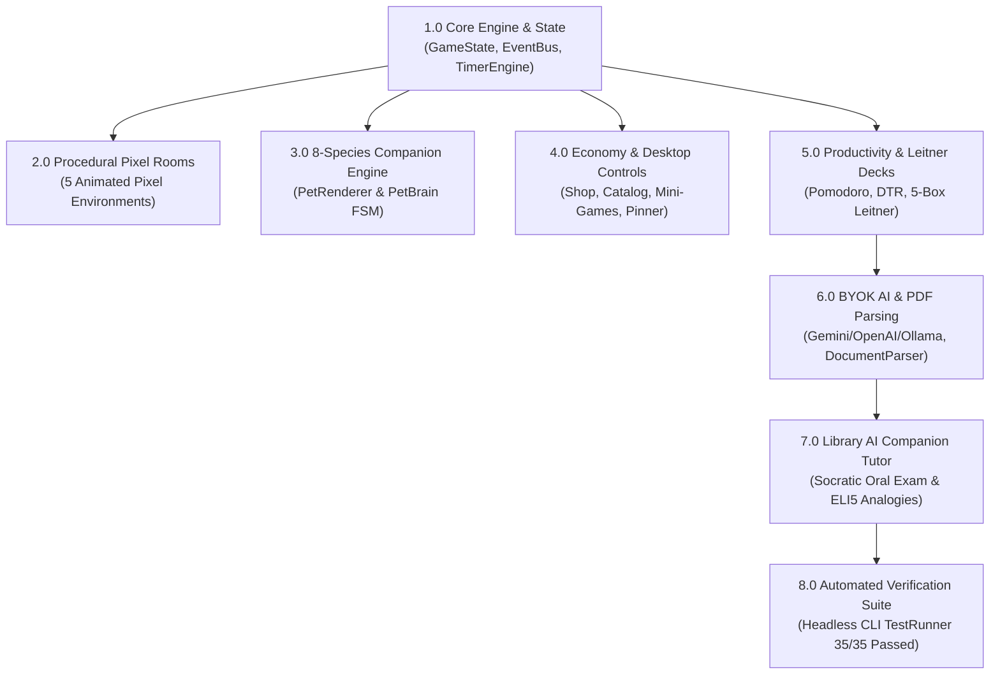

# ⏳ Kronos Project Overview & Architecture Map

> **Personal Lo-Fi Focus Companion & Study Engine**  
> *Built with Godot 4 (GDScript) • Pure Procedural Pixel Art (`_draw()`) • BYOK AI Socratic Tutor*

---

## 🗺️ System Architecture Flow

---

## 📌 Phase 1: Core Engine Architecture & Autoloads (1.0)
*The global foundation layer handling state persistence, decoupled event buses, timer accumulators, audio, and native OS notifications.*

### 1.1 Global State & Persistence (`GameState.gd`)
- `1.1.1` **Player Progression Stats**: Currency (Gold Coins), XP, Level, and Energy/Joy stats. ✅
- `1.1.2` **Room Routing & Unlocks**: Unlocked rooms array (`unlocked_rooms`) and active room pointer (`active_room`). ✅
- `1.1.3` **Companion State**: Active companion selection, unlocked species list, and cosmetic attachment state. ✅
- `1.1.4` **Auto-Save / Load**: Atomic JSON serialization to `user://savegame.json` with fallback defaults. ✅

### 1.2 Decoupled Event Bus (`EventBus.gd`)
- `1.2.1` **Timer Signals**: `timer_started`, `timer_tick`, `timer_completed`, and `phase_changed`. ✅
- `1.2.2` **Economy & Pet Signals**: `currency_changed`, `xp_gained`, `pet_action_triggered`, and `room_transition_requested`. ✅
- `1.2.3` **AI & Study Signals**: `card_generated`, `tutor_response_ready`, and `toast_requested`. ✅

### 1.3 Focus Timer Engine (`TimerEngine.gd`)
- `1.3.1` **3-Phase State Machine**: Focus Work Session ➔ Short Break ➔ Long Break interval loop. ✅
- `1.3.2` **Drift-Free Clock**: Delta accumulator countdown timer independent of frame-rate stutter. ✅
- `1.3.3` **Playback Controls**: Start, pause, resume, skip phase, and reset functions. ✅

### 1.4 Audio & Local Storage (`AudioManager.gd` & `DatabaseManager.gd`)
- `1.4.1` **Audio Buses & Chiptune SFX**: Volume bus controllers (BGM, SFX, UI) with procedural retro sound generation. ✅
- `1.4.2` **Local Database Manager**: Structured JSON storage for custom flashcard decks, cards, and daily task lists. ✅

### 1.5 Notification System (`NotificationManager.gd` & `DesktopToast.gd`)
- `1.5.1` **In-Engine Pixel Toast**: Animated retro banner with color-coded alerts (`INFO`, `SUCCESS`, `WARNING`, `ERROR`). ✅
- `1.5.2` **Windows Native Notifications**: Tray-level desktop toast alerts dispatched when the application is unfocused or minimized. ✅

---

## 🏡 Phase 2: Procedural Pixel Art & Multi-Room World (2.0)
*Pure Godot procedural pixel art rendering via `_draw()` — 100% vector-free, zero external PNG sprite dependencies.*

### 2.1 Multi-Room Framework (`BaseRoom.gd` & `RoomManager.gd`)
- `2.1.1` **Room Topology**: Continuous coordinate topology with relative East (`+1`), West (`-1`), and same-room checks. ✅
- `2.1.2` **Doorway Interactive Triggers (`Door.gd`)**: Hover tooltips, smooth fade transitions, and shop unlock gating. ✅
- `2.1.3` **Vertical Connections (`Ladder.gd`)**: Multi-floor ladder climbs and upper loft routing. ✅

### 2.2 Procedural Room Environments
- `2.2.1` **Study Bedroom (`Bedroom.gd`)**: Golden oak parquet floor, bay window with dynamic sky cycle, swinging pendulum clock, cozy daybed with patchwork quilt, and study workstation desk with live typing terminal code glow (`>_`). ✅
- `2.2.2` **Cozy Living Room (`LivingRoom.gd`)**: Wainscot wood paneling, brick fireplace with animated multi-layer hearth flames, plush tufted sofa, and vinyl turntable spinning with floating music notes. ✅
- `2.2.3` **Vintage Library (`Library.gd`)**: Rich dark walnut paneling, vaulted ceiling rafters, packed floor-to-ceiling bookshelves, stained-glass light shafts, glowing candle, and brass globe on stand. ✅
- `2.2.4` **Bakery Kitchen (`Kitchen.gd`)**: Terracotta/cream checkerboard floor tiles, iron hearth oven, hanging copper pans, steaming espresso cup, and bakery pastry counter. ✅
- `2.2.5` **Botanical Greenhouse (`Greenhouse.gd`)**: Glass ceiling panes, grey flagstone tiles, lush Monstera with leaf veins, terracotta flower pots with 4-stage bloom cycles, and fluttering blue/orange butterflies. ✅

### 2.3 Dynamic Atmosphere (`WeatherRenderer.gd`)
- `2.3.1` **Procedural Weather Particles**: Sunbeams, rain streaks, drifting snow flakes, and twinkling night stars. ✅
- `2.3.2` **Real-Time Day/Night Cycle**: Dynamic palette and lighting shifts across Morning, Afternoon, Golden Sunset, and Midnight. ✅

---

## 🐾 Phase 3: 8-Species Companion Engine & Autonomous AI Brain (3.0)
*Living procedural pixel companions with 3-tone shading, personality micro-animations, and autonomous wandering.*

### 3.1 8 Companion Species (`PetRenderer.gd`)
- `3.1.1` **Shiba Inu**: Honey-gold fur (`#f59e0b`), cream chest patch, alert pointed ears, and characteristic curled wagging tail. ✅
- `3.1.2` **Calico Cat**: Snow-white base, ginger/chocolate fur patches, pointed ears, and smooth tail flick. ✅
- `3.1.3` **Fluffy Bunny**: Soft cream fur, long twitching ears with pink padding, and round cotton tail. ✅
- `3.1.4` **Emperor Penguin**: Midnight navy coat, bright yellow cheek blushes, and cute waddling feet. ✅
- `3.1.5` **Red Fox**: Flame-orange fur, white tail brush, alert pointed snout, and dark paws. ✅
- `3.1.6` **Red Panda**: Deep auburn coat, ringed bushy tail, and distinct facial mask markings. ✅
- `3.1.7` **Capybara**: Toasted chestnut coat, relaxed sleepy eyes, and a cute yuzu citrus fruit resting on head. ✅
- `3.1.8` **Barn Owl**: Tawny plumage, speckled chest feathers, rotating head, and large blinking anime eyes. ✅

### 3.2 13 Procedural Animation States
- `3.2.1` `idle`: Sine-wave chest expansion breathing and periodic ear twitches. ✅
- `3.2.2` `walking`: Natural 4-legged walk cycle with synchronized head bobbing. ✅
- `3.2.3` `running`: High-speed sprint across room platform boundaries. ✅
- `3.2.4` `sitting`: Relaxed upright resting stance. ✅
- `3.2.5` `sleeping`: Curled donut posture with floating animated 'Z' bubbles. ✅
- `3.2.6` `petted`: Heart bursts (`♥`), happy squint eyes (`^ ◡ ^`), and fast tail wagging. ✅
- `3.2.7` `eating`: Snack munching animation with falling crumb particles. ✅
- `3.2.8` `focus`: Wearing lo-fi headphones, tapping paws on keyboard at workstation desk. ✅
- `3.2.9` `celebrating`: Confetti burst particles and joyful bouncing. ✅
- `3.2.10` `reading`: Sitting in Library with an open study book. ✅
- `3.2.11` `cooking`: Chef hat equipped with wooden spoon stirring in Kitchen. ✅
- `3.2.12` `gardening`: Greenhouse watering can with animated falling water droplets. ✅
- `3.2.13` `entering_door` / `exiting_door`: Smooth room transition walk-through. ✅

### 3.3 Autonomous Navigation (`PetBrain.gd`)
- `3.3.1` **Wandering FSM**: Autonomous roam timers, idle pauses, and dynamic destination picker. ✅
- `3.3.2` **Platform Clamping**: Dynamic boundary clamping to room platform floors and obstacle avoidance. ✅
- `3.3.3` **Workstation Snap**: Automatically navigates and sits at the desk when a focus timer starts. ✅
- `3.3.4` **Inter-Room Roaming**: Autonomous door traversal between connected rooms. ✅

### 3.4 Cosmetics & Thought Bubbles (`CosmeticLayer.gd` & `ThoughtBubble.gd`)
- `3.4.1` **Wearable Items**: Lo-Fi Headphones, Chef Hat, Reading Glasses, Bowties, and Ribbons. ✅
- `3.4.2` **Dynamic Thoughts**: Real-time pixel thought bubbles reflecting mood, hunger, and timer state. ✅

---

## 🛒 Phase 4: Economy, Mini-Games & Desktop Controls (4.0)
*In-game shop progression, relaxing breaks, and desktop window integration.*

### 4.1 In-Game Economy & Catalog (`LeftPanel.gd` & `ShopTab.gd`)
- `4.1.1` **Companion Catalog**: Unlock 8 pet species with earned Gold Coins. ✅
- `4.1.2` **Room Real Estate**: Unlock 5 rooms (Living Room, Vintage Library, Kitchen, Botanical Greenhouse). ✅
- `4.1.3` **Food Treats Inventory**: Biscuits, Coffee, Berry Muffins, and Carrots. ✅
- `4.1.4` **Cosmetic Accessories**: Hats, glasses, and desk decor. ✅

### 4.2 Arcade Mini-Games (`MinigameHub.gd`)
- `4.2.1` **Snack Catch (`SnackCatchGame.gd`)**: Catch falling treats into a basket with combo score multipliers. ✅
- `4.2.2` **Memory Match (`MemoryMatchGame.gd`)**: Flip-card memory concentration with pixel item icons. ✅
- `4.2.3` **Plant Bloom (`PlantBloomGame.gd`)**: Greenhouse rhythm watering game to grow rare flowers. ✅
- `4.2.4` **Flashcard Arcade (`FlashcardEngine.gd`)**: Rapid-fire flashcard review arcade. ✅

### 4.3 Desktop Window Controller (`WindowController.gd`)
- `4.3.1` **Borderless Frameless Window**: Custom titlebar drag regions and window controls. ✅
- `4.3.2` **Always-On-Top Pinning**: Native C++ pin helper (`kronos_pinner.exe`) for window stacking. ✅
- `4.3.3` **Window Minimize / Maximize**: Clean minimize to taskbar and smooth restore. ✅

---

## ⏱️ Phase 5: Productivity Studio & Spaced Repetition (5.0)
*Comprehensive study toolset with 5-box Leitner spaced repetition.*

### 5.1 Focus Timer Tab (`FocusTimerTab.gd`)
- `5.1.1` **Retro Pixel Timer UI**: Large font display with customizable Work / Short Break / Long Break intervals. ✅
- `5.1.2` **Session Statistics**: Session counter, total focus minutes accumulator, and daily streak tracking. ✅
- `5.1.3` **Pet Focus Sync**: Companion equips headphones and studies alongside you at the desk. ✅

### 5.2 Tasks & DTR Logger (`TasksStudioTab.gd` & `DTRStudioTab.gd`)
- `5.2.1` **Daily Task Checklist**: Priority tagging, task completion checkboxes, and Gold rewards. ✅
- `5.2.2` **Daily Time Record (DTR)**: Timestamped session logging with exportable study logs. ✅

### 5.3 Deck Studio & Leitner Box Engine (`DeckStudioTab.gd`)
- `5.3.1` **Deck & Card CRUD**: Create, edit, tag, search, and delete flashcard decks. ✅
- `5.3.2` **5-Box Leitner Scheduling**: Interval-based spaced repetition progression. ✅
- `5.3.3` **Manual Flip-Card Review**: Interactive front/back flip modal with "Mastered", "Hard", and "Forgot" grading. ✅

---

## 🤖 Phase 6: BYOK AI Synthesis & Document Ingestion (6.0)
*Bring-Your-Own-Key local AI engine with built-in PDF text decompressor.*

### 6.1 Multi-Provider AI Engine (`AIService.gd`)
- `6.1.1` **Multi-Provider Support**: Google Gemini (v1beta REST), OpenAI (v1/chat), and Local Ollama (v1/generate). ✅
- `6.1.2` **Secure Key Storage**: Saved locally in encrypted user config (`user://ai_config.json`). ✅
- `6.1.3` **Setup Guides & Ping**: Provider setup URLs and live connection test ping. ✅
- `6.1.4` **Schema Normalizer**: Robust JSON normalizer handling markdown code fences and array variants. ✅
- `6.1.5` **Auto-Fallback & Retry**: Automatic model rotation on 429/404 (`gemini-2.5-flash` ➔ `gemini-2.0-flash` ➔ `gemini-1.5-flash`). ✅

### 6.2 Document Ingestion Engine (`DocumentParser.gd`)
- `6.2.1` **Pure GDScript FlateDecode PDF Extractor**: Decompresses and extracts text from PDFs without third-party CLI tools. ✅
- `6.2.2` **Document Segmenter**: Chunks `.txt` and `.md` files into logical sections by headers and token count. ✅
- `6.2.3` **Token Estimator**: Prevents prompt truncation by estimating token budgets before API dispatch. ✅

### 6.3 Automated Flashcard Generation & Polish
- `6.3.1` **One-Click Synthesis**: Generates clean Q&A flashcards directly from lecture PDFs or notes. ✅
- `6.3.2` **Card Polisher**: Shortens wordy cards and generates memory mnemonics. ✅

---

## 🎓 Phase 7: Interactive Socratic AI Pet Tutor (7.0) — **CURRENT PHASE**
*Natural language conversational AI study tutor living in the Vintage Library.*

### 7.1 Study Library Sanctuary Gating
- `7.1.1` **Sanctuary Checker (`GameState.is_in_study_library()`)**: Ensures no unsolicited quizzes appear on app start or in relaxation rooms. ✅
- `7.1.2` **Library Unlock Gating**: AI Tutor mode is exclusively unlocked and activated inside the **Vintage Library (`room_library`)**. ✅

### 7.2 Socratic Natural Language Oral Exam Engine
- `7.2.1` **Natural Language Student Input**: Type or speak your own conversational answers to flashcards. ✅
- `7.2.2` **Conceptual Semantic Grading**: Evaluates comprehension on a 1–5 scale with `mastered`, `partial`, and `needs_review` verdicts. ✅
- `7.2.3` **In-Character Companion Feedback**: Active pet companion provides warm, personalized, encouraging dialogue. ✅
- `7.2.4` **Socratic Follow-Up Hints**: Offers helpful leading questions instead of giving away answers when partially correct. ✅

### 7.3 Instant Socratic Analogy Engine (ELI5)
- `7.3.1` **One-Click ELI5 Button**: Generates simple, memorable real-world analogies on difficult concepts. ✅
- `7.3.2` **2-Sentence Constraint**: Keeps explanations crisp and easy to understand without overwhelming walls of text. ✅

### 7.4 Leitner & Economy Synchronization
- `7.4.1` **Mastery Progression**: Scores of 4–5 advance cards to the next Leitner Box and grant EXP + Gold Coins. ✅
- `7.4.2` **Spaced Reinforcement**: Scores of 1–2 demote cards back to Box 1 for immediate review. ✅

---

## 🧪 Phase 8: Automated CLI Verification & Headless Testing (8.0)
*100% automated headless test suite executing in the Godot engine console.*

### 8.1 Headless CLI Test Suite (`TestRunner.gd` & `LiveTutorCLIRunner.gd`)
- `8.1.1` **Test 1**: Species Palettes & Frame Configurations (8 species verified). ✅
- `8.1.2` **Test 2**: Animation State frame counts and playback speeds (13 states verified). ✅
- `8.1.3` **Test 3**: Particle emission and physics step verification. ✅
- `8.1.4` **Test 4**: PetBrain room navigation and door entry/exit traversal. ✅
- `8.1.5` **Test 5**: 5-Room topology and relative coordinate verification. ✅
- `8.1.6` **Test 6**: Catalog definitions and pet item store validation. ✅
- `8.1.7` **Test 7**: AIService BYOK configuration and JSON normalizer tests. ✅
- `8.1.8` **Test 8**: DocumentParser FlateDecode PDF text extraction and section chunking. ✅
- `8.1.9` **Test 9**: Live AI flashcard synthesis against Google Gemini API. ✅
- `8.1.10` **Test 10**: Study Library sanctuary gating and mock oral exam evaluator. ✅
- `8.1.11` **Test 11**: Live end-to-end Socratic oral grading and ELI5 analogy generation via Gemini in terminal. ✅
- `8.1.12` **Total Test Result**: **35/35 Passing Tests (0 Failures, Exit Code 0)**. ✅

---

## 📊 Summary Table

| Phase | System / Milestone | Modules & Files | Status |
| :---: | :--- | :--- | :---: |
| **1.0** | Core Engine & Autoloads | `GameState.gd`, `EventBus.gd`, `TimerEngine.gd`, `AudioManager.gd` | ✅ Done |
| **2.0** | Procedural Pixel Rooms | `Bedroom.gd`, `LivingRoom.gd`, `Library.gd`, `Kitchen.gd`, `Greenhouse.gd` | ✅ Done |
| **3.0** | 8-Species Companion Engine | `PetRenderer.gd`, `PetBrain.gd`, `CosmeticLayer.gd`, `ThoughtBubble.gd` | ✅ Done |
| **4.0** | Economy & Desktop Controls | `LeftPanel.gd`, `ShopTab.gd`, `MinigameHub.gd`, `WindowController.gd` | ✅ Done |
| **5.0** | Productivity & Leitner Decks | `FocusTimerTab.gd`, `TasksStudioTab.gd`, `DTRStudioTab.gd`, `DeckStudioTab.gd` | ✅ Done |
| **6.0** | BYOK AI & PDF Ingestion | `AIService.gd`, `DocumentParser.gd` | ✅ Done |
| **7.0** | Library AI Socratic Tutor | `DeckStudioTab.gd` (`AITutorModal`), `AIService.gd`, `Library.gd` | ✅ Done |
| **8.0** | Automated Test Suite | `TestRunner.gd`, `LiveTutorCLIRunner.gd` (35/35 Passing) | ✅ Done |
